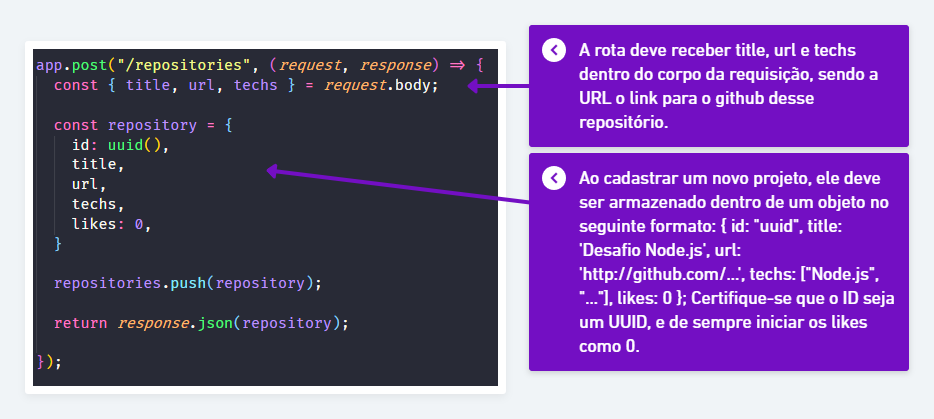
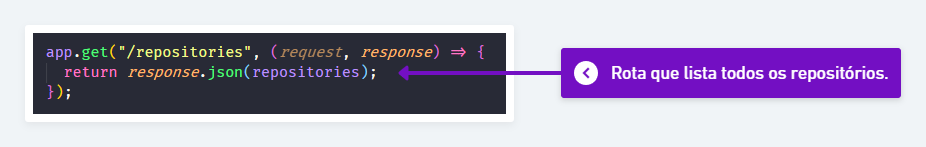
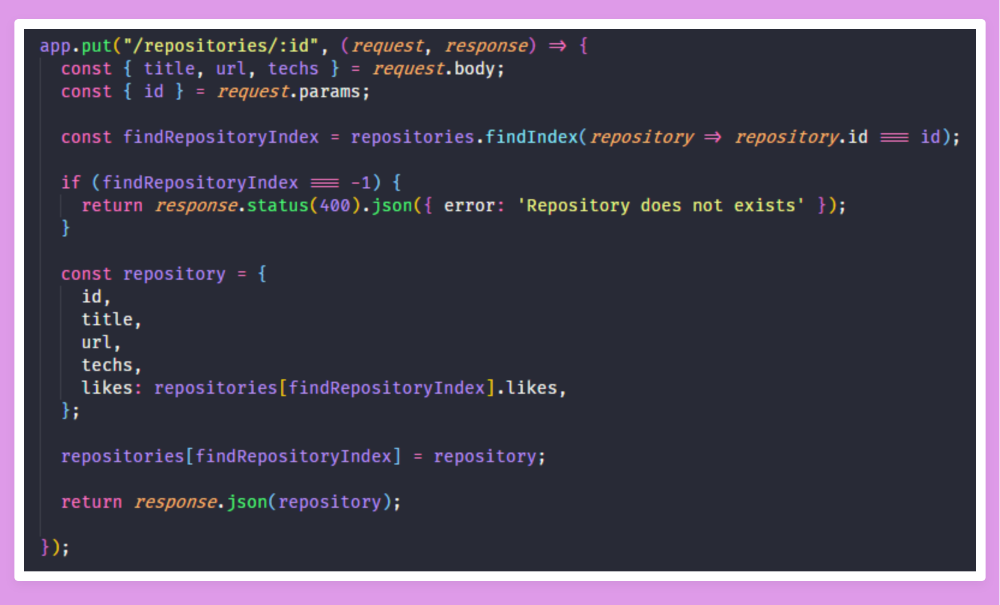
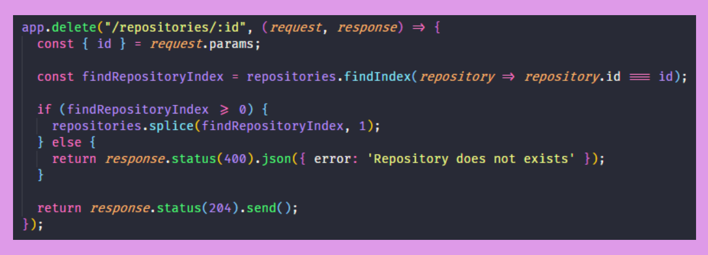
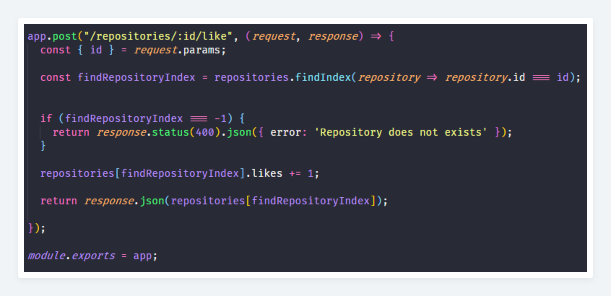

## 💻 Projeto

## :rocket: Sobre o desafio

Nesse desafio, criamos uma aplicação utilizando oque aprendemos até agora no Node.js!

Esta é uma aplicação criada para armazenar repositórios do meu portfólio, que permite a criação, listagem, atualização e remoção dos repositórios, e além disso também permite que os repositórios possam receber "likes".

### Rotas da aplicação

POST: A rota deve receber `title`, `url` e `techs` dentro do corpo da requisição, sendo a URL o link para o github desse repositório. Ao cadastrar um novo projeto, ele deve ser armazenado dentro de um objeto no seguinte formato: `{ id: "uuid", title: 'Desafio Node.js', url: 'http://github.com/...', techs: ["Node.js", "..."], likes: 0 }`; Certifique-se que o ID seja um UUID, e de sempre iniciar os likes como 0.

 

GET: Rota que lista todos os repositórios;

 

PUT: A rota deve alterar apenas o `title`, a `url` e as `techs` do repositório que possua o `id` igual ao `id` presente nos parâmetros da rota;

 

DELETE: A rota deve deletar o repositório com o `id` presente nos parâmetros da rota;

 

POST: A rota deve aumentar o número de likes do repositório específico escolhido através do `id` presente nos parâmetros da rota, a cada chamada dessa rota, o número de likes deve ser aumentado em 1;

 

### Específicação dos testes

Para esse desafio tivemos os seguintes testes:

- **`should be able to create a new repository`**: Para que esse teste passe, sua aplicação deve permitir que um repositório seja criado, e retorne um json com o projeto criado.

- **`should be able to list the repositories`**: Para que esse teste passe, sua aplicação deve permitir que seja retornado um array com todos os repositórios que foram criados até o momento.

- **`should be able to update repository`**: Para que esse teste passe, sua aplicação deve permitir que sejam alterados apenas os campos `url`, `title` e `techs`.

- **`should not be able to update a repository that does not exist`**: Para que esse teste passe, você deve validar na sua rota de update se o id do repositório enviado pela url existe ou não. Caso não exista, retornar um erro com status `400`.

- **`should not be able to update repository likes manually`**: Para que esse teste passe, você não deve permitir que sua rota de update altere diretamente os likes desse repositório, mantendo o mesmo número de likes que o repositório já possuia antes da atualização. Isso porque o único lugar que deve atualizar essa informação é a rota responsável por aumentar o número de likes.

- **`should be able to delete the repository`**: Para que esse teste passe, você deve permitir que a sua rota de delete exclua um projeto, e ao fazer a exclusão, ele retorne uma resposta vazia, com status `204`.

- **`should not be able to delete a repository that does not exist`**: Para que esse teste passe, você deve validar na sua rota de delete se o id do repositório enviado pela url existe ou não. Caso não exista, retornar um erro com status `400`.

- **`should be able to give a like to the repository`**: Para que esse teste passe, sua aplicação deve permitir que um repositório com o id informado possa receber likes. O valor de likes deve ser incrementado em 1 a cada requisição, e como resultado, retornar um json contendo o repositório com o número de likes atualizado.

- **`should not be able to like a repository that does not exist`**: Para que esse teste passe, você deve validar na sua rota de like se o id do repositório enviado pela url existe ou não. Caso não exista, retornar um erro com status `400`.

## :memo: Licença

Esse projeto está sob a licença MIT. Veja o arquivo [LICENSE](LICENSE) para mais detalhes.

